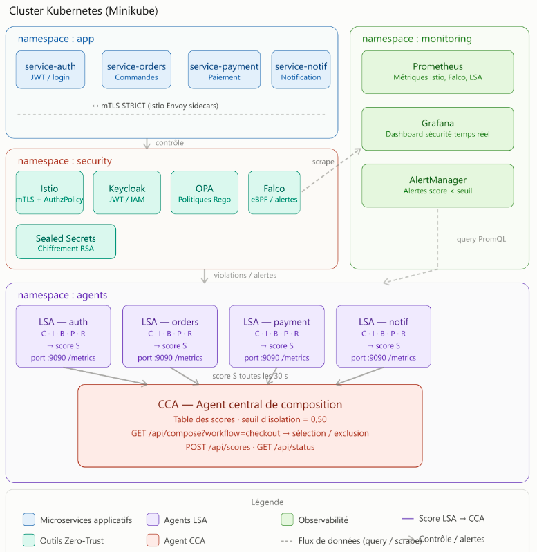
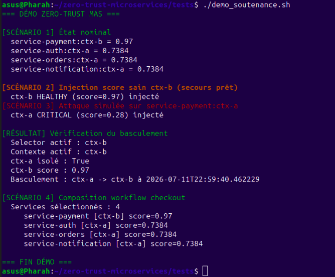

## Description

Zero-trust microservices on Kubernetes with multi-agent security scoring, automatic context failover, and adaptive service composition.

## Overview

A zero-trust microservices platform deployed on Kubernetes, built around a multi-agent system (MAS) that continuously evaluates service security and automatically reroutes traffic when a deployment context becomes compromised.

## Architecture

## Technical Stack
* Kubernetes (Minikube)
* Istio (mTLS)
* Keycloak (identités)
* OPA (autorisation)
* Falco (runtime security)
* Sealed Secrets (gestion des secrets)
* Prometheus + Grafana (observabilité)
* Python (agents LSA et CCA)

## Final Results

